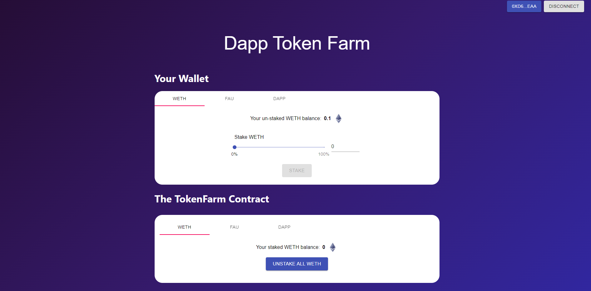

# fullStackDefiDemo1

 

</a>

 

## Summary 
This is a demo repo to build a full stack defi staking application for basic yield farming, borrowing and lending. It allows you to:

- `stakeTokens`: Add any approved token to the farming contract for yeild farming or collateral.
- `unStakeTokens`: Remove your tokens from the contract.
- `getUserTotalValue`: Get the total value that users have supplied based on calculations from the Chainlink Price Feeds. 
- `issueTokens`: Admins may issue a reward to the users staking on the contract.

The backed of the project is made with brownie and python, the smart contracts are written in solidity, and the frontend is made with typescript and react.

## Deployment
The contracts are built utilising the brownie framework, and are deployed to the kovan test network.

## Testing
- Local testing is performed on ganache
- Integration testing is performed on kovan 

## Made with
- Solidity
- brownie
- python
- typescript
- react

### This repo is a project created during the course;
- smartcontractkit/full-blockchain-solidity-course-py